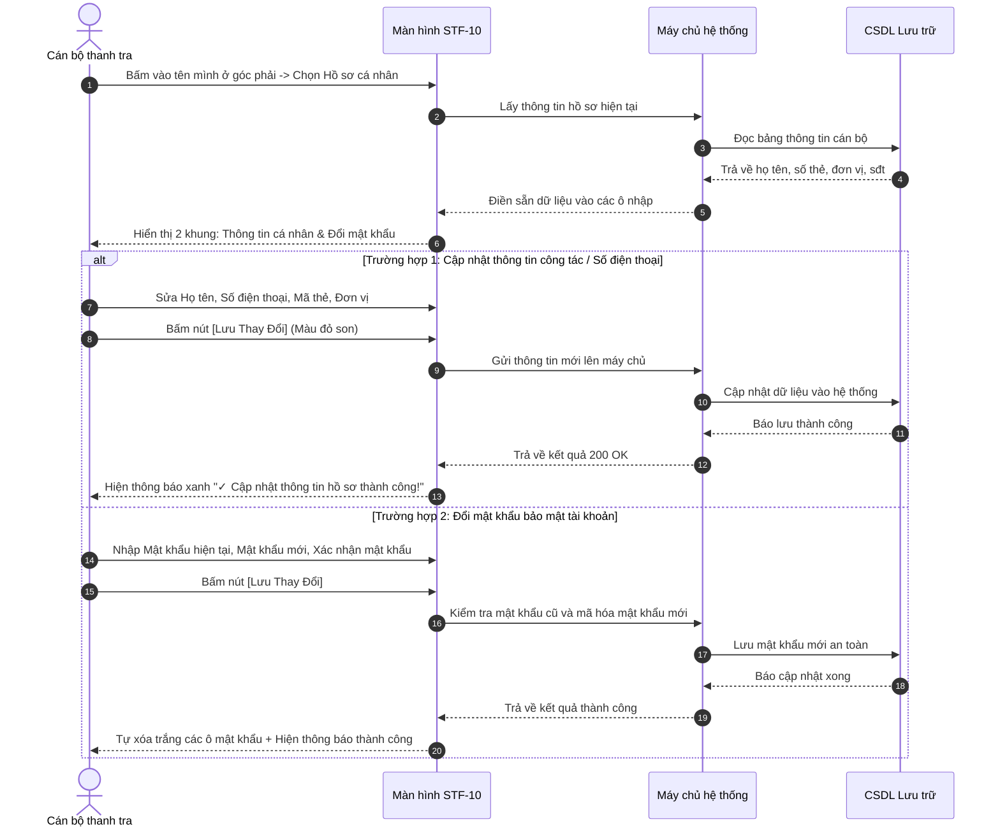

# STF-10 — Hồ Sơ & Số Thẻ Cán Bộ (Định Danh Công Tác & Đổi Mật Khẩu)

> **Tài liệu hướng dẫn & đặc tả màn hình — Hệ thống DustGuard VN**  
> Màn hình giúp cán bộ cập nhật thông tin cá nhân, số hiệu thẻ thanh tra viên, đơn vị công tác và số điện thoại nhận tin khẩn cấp. Thông tin này tự động điền vào mục "Người lập biên bản" trên các văn bản kiểm tra in ra giấy, đồng thời cho phép cán bộ đổi mật khẩu định kỳ để bảo vệ tài khoản công vụ.

---

## 1. Thông Tin Màn Hình (Screen Identity)

| Mục | Nội dung | Giải thích dễ hiểu |
|---|---|---|
| **Mã màn hình** | `STF-10` | Mã viết tắt để tra cứu nhanh trong tài liệu |
| **Tên tiếng Việt** | **Hồ sơ & số thẻ cán bộ** (Định danh công tác) | Tên gọi hiển thị khi bấm vào biểu tượng cá nhân |
| **Tên tiếng Anh** | Staff Profile & Operational Identity | Tên dùng khi kết nối kỹ thuật |
| **Đường dẫn (URL)** | `/staff/profile` | Địa chỉ trang web trên trình duyệt |
| **File giao diện** | [`app/src/apps/staff/pages/profile/StaffProfilePage.jsx`](file:///d:/07-Competitions-Hackathons/unicef-dustguard/app/src/apps/staff/pages/profile/StaffProfilePage.jsx) | File mã nguồn hiển thị giao diện |
| **File xử lý dữ liệu** | [`app/server/routes/api/users.js`](file:///d:/07-Competitions-Hackathons/unicef-dustguard/app/server/routes/api/users.js) | File máy chủ lưu thông tin cán bộ |
| **Ai được dùng?** | Cán bộ thanh tra, người trực ca, lãnh đạo đơn vị | Mọi cán bộ có tài khoản công vụ |
| **Tình trạng kết nối** | **Đang hoạt động tốt** | Lưu dữ liệu thật vào hệ thống |

---

## 2. Mục Đích & Nghiệp Vụ Thực Tế

### 2.1. Cán bộ dùng màn hình này để làm gì?
Màn hình đóng vai trò là "Thẻ công tác điện tử" của cán bộ trên hệ thống, giúp:
1. **Lưu thông tin công vụ chuẩn xác**:
   - Họ và tên đầy đủ của cán bộ.
   - Mã số thẻ thanh tra viên (ví dụ: `TT-HN-0428`).
   - Đơn vị / Phòng ban công tác (ví dụ: `Đội Thanh tra Xây dựng & Đô thị Quận Thanh Xuân`).
   - Chức vụ chuyên môn (ví dụ: `Thanh tra viên chính / Tổ trưởng Giám sát`).
2. **Tự động điền vào các biên bản kiểm tra in ra giấy**:
   - Khi cán bộ lập Biên bản kiểm tra công trình hoặc Báo cáo vi phạm, hệ thống tự lấy Họ tên, Chức vụ và Mã số thẻ điền vào mục *Người lập biên bản*, không phải gõ tay nhiều lần.
3. **Cập nhật số điện thoại nhận tin báo khẩn cấp**:
   - Nhập số điện thoại để hệ thống gửi tin nhắn SMS / Zalo khi có trạm đo báo động bụi vượt mức nguy hiểm ($PM10 > 150\,\mu\text{g/m}^3$).
4. **Đổi mật khẩu bảo mật tài khoản**:
   - Cán bộ chủ động đổi mật khẩu định kỳ để bảo vệ tài khoản công vụ của mình.

### 2.2. Giá trị thực tế thay thế cách làm cũ
- **Không còn tình trạng viết tay sai số thẻ trên biên bản**: Mọi biên bản in ra đều chuẩn xác thông tin cá nhân và số hiệu thẻ công tác đã được duyệt.
- **Khóa cố định Email đăng nhập**: Email công vụ (`staff.an@dustguard.vn`) bị khóa cố định, chỉ quản trị viên mới được thay đổi nhằm ngăn chặn việc chuyển nhượng tài khoản trái phép.
- **Lưu nhanh, hiển thị thông báo rõ ràng**: Bấm Lưu là hệ thống cập nhật ngay lập tức, hiện thanh thông báo màu xanh báo thành công.

---

## 3. Đối Tượng Người Dùng & Các Bước Thực Hiện

### 3.1. Ai sử dụng màn hình này?
- **Cán bộ thanh tra / Giám sát viên**: Cập nhật thông tin công tác, đổi số điện thoại nhận tin khẩn, đổi mật khẩu định kỳ.
- **Tổ trưởng ca trực**: Kiểm tra số thẻ của cán bộ trong đội để đảm bảo thông tin khớp với danh sách quản lý.

### 3.2. Sơ đồ các bước xử lý hàng ngày



---

## 4. Bố Cục Giao Diện & Hình Minh Họa Dễ Hiểu (Wireframe)

### 4.1. Khung nhìn tổng thể trên màn hình máy tính (14 inch trở lên)

```text
+--------------------------------------------------------------------------------------------------------------------+
| [THANH TIÊU ĐỀ TRÊN CÙNG]                                                          (🔔 8) [Cán bộ: Nguyễn Minh An] |
+--------------------------------------------------------------------------------------------------------------------+
|                                                                                                                    |
|  +--------------------------------------------------------------------------------------------------------------+  |
|  | Hồ Sơ Cán Bộ & Định Danh Công Tác                                                                            |  |
|  | Quản lý thông tin cá nhân, số hiệu thẻ thanh tra, đơn vị công tác và bảo mật tài khoản công vụ.              |  |
|  +--------------------------------------------------------------------------------------------------------------+  |
|                                                                                                                    |
|  [ ✓ Cập nhật thông tin hồ sơ thành công! Dữ liệu đã đồng bộ vào biên bản in ấn theo mẫu nhà nước.             ]   |
|                                                                                                                    |
|  +--------------------------------------------------------------------------------------------------------------+  |
|  | KHUNG 1: THÔNG TIN CÁ NHÂN & CÔNG TÁC CÔNG VỤ                                                                 |  |
|  +--------------------------------------------------------------------------------------------------------------+  |
|  | Họ và tên cán bộ *                               | Email đăng nhập công vụ (Khóa cố định)                     |  |
|  | [ Nguyễn Minh An                               ] | [ staff.an@dustguard.vn                                  ] |  |
|  |                                                  | 🔒 Liên hệ Quản trị viên nếu cần thay đổi email            |  |
|  |--------------------------------------------------+------------------------------------------------------------|  |
|  | Số điện thoại nhận tin khẩn cấp *                | Mã thẻ / Số hiệu Thanh tra viên                            |  |
|  | [ 0912 345 678                                 ] | [ TT-HN-0428                                             ] |  |
|  | (Dùng nhận tin nhắn khi bụi vượt mức cho phép)   | (In trực tiếp trên Biên bản kiểm tra A4)                   |  |
|  |--------------------------------------------------+------------------------------------------------------------|  |
|  | Đơn vị / Phòng ban công tác                      | Chức danh / Vị trí chuyên môn                              |  |
|  | [ Đội Thanh tra Xây dựng & Đô thị Q. Thanh Xuân ] | [ Thanh tra viên chính / Tổ trưởng Giám sát               ] |  |
|  +--------------------------------------------------------------------------------------------------------------+  |
|                                                                                                                    |
|  +--------------------------------------------------------------------------------------------------------------+  |
|  | KHUNG 2: ĐỔI MẬT KHẨU BẢO MẬT (Tùy chọn)                                                                      |  |
|  +--------------------------------------------------------------------------------------------------------------+  |
|  | Mật khẩu hiện tại                                | Mật khẩu mới (Tối thiểu 8 ký tự, gồm số và ký tự đặc biệt) |  |
|  | [ ••••••••••••                                 ] | [ ••••••••••••                                           ] |  |
|  |--------------------------------------------------+------------------------------------------------------------|  |
|  | Xác nhận mật khẩu mới                            |                                                            |  |
|  | [ ••••••••••••                                 ] | ⓘ Để trống các ô này nếu bạn không muốn đổi mật khẩu     |  |
|  +--------------------------------------------------------------------------------------------------------------+  |
|                                                                                                                    |
|  +--------------------------------------------------------------------------------------------------------------+  |
|  | [ Lưu Thay Đổi ] (Màu đỏ son, cao 44px)                  [ Hủy bỏ ]                                           |  |
|  +--------------------------------------------------------------------------------------------------------------+  |
+--------------------------------------------------------------------------------------------------------------------+
```

### 4.2. Giải thích chi tiết các khu vực nhập liệu
1. **Khung 1 — Thông tin cá nhân & Công tác**:
   - **Họ và tên cán bộ**: Ô bắt buộc điền, dùng để hiển thị trên hệ thống và in vào biên bản.
   - **Email đăng nhập**: Khóa xám không cho tự sửa, muốn đổi phải liên hệ Quản trị viên.
   - **Số điện thoại nhận tin khẩn cấp**: Số điện thoại nhận tin nhắn SMS/Zalo khi có sự cố ô nhiễm.
   - **Mã thẻ thanh tra viên**: Số hiệu thẻ công tác (ví dụ: `TT-HN-0428`).
   - **Đơn vị công tác**: Tên cơ quan chủ quản của cán bộ.
   - **Chức danh chuyên môn**: Chức vụ công tác.
2. **Khung 2 — Đổi mật khẩu bảo mật**:
   - Gồm 3 ô: Mật khẩu hiện tại, Mật khẩu mới, Xác nhận mật khẩu mới.
   - Nếu chỉ muốn sửa số điện thoại hay chức vụ thì để trống 3 ô này.
3. **Cụm nút hành động phía dưới**:
   - Nút `[Lưu Thay Đổi]` màu đỏ son nổi bật, bấm vào là lưu lại toàn bộ.
   - Nút `[Hủy bỏ]` đặt lại các ô về như cũ.

---

## 5. Dữ Liệu & Liên Kết Hệ Thống

### 5.1. Các đường liên kết dữ liệu phục vụ màn hình

| Lệnh | Đường dẫn hệ thống | Mục đích sử dụng |
|---|---|---|
| `PATCH` | `/api/users/:id` | Lưu thông tin họ tên, số điện thoại, mã thẻ, đơn vị |
| `POST` | `/api/auth/change-password` | Gửi yêu cầu đổi mật khẩu tài khoản |

### 5.2. Các bảng lưu trữ trong hệ thống
1. **`users`**: Lưu thông tin đăng nhập (Email, mật khẩu đã mã hóa an toàn, họ tên, số điện thoại, quyền hạn).
2. **`staff_profiles`**: Lưu thông tin chi tiết của cán bộ (Mã số thẻ, cơ quan, chức vụ, địa bàn phụ trách, số điện thoại khẩn cấp).

---

## 6. Danh Sách Nút Bấm & Thao Tác Thường Dùng

| Nút bấm / Thao tác | Vị trí trên màn hình | Hành vi khi bấm | Ai được bấm? |
|---|---|---|:---:|
| **`[Lưu Thay Đổi]`** (Nút chính) | Dưới cùng của trang | Gửi thông tin đã sửa lên máy chủ và hiện thông báo xanh báo thành công. | Cán bộ |
| **`[Hủy bỏ]`** | Cạnh nút Lưu thay đổi | Đặt lại toàn bộ các ô nhập về giá trị ban đầu. | Cán bộ |
| **Bấm chọn ô nhập liệu** | Các khung thông tin | Nhập chữ, số điện thoại hoặc mật khẩu mới. | Cán bộ |

---

## 7. Quy Chuẩn Trình Bày & Trải Nghiệm Người Dùng (UI/UX)

### 7.1. Màu sắc rõ ràng, dễ nhìn (Không làm mờ kính)
- **Nền trang**: Màu kem sáng `#FAFAF9`, êm dịu, không gây chói lóa.
- **Nền các khung nhập liệu**: Màu trắng sáng `#FFFFFF`, viền xám nhạt `#E7E5E4`.
- **Ô bị khóa (Email)**: Nền xám nhạt `#F5F5F4`, chữ xám mờ, con trỏ chuột hiện dấu cấm sửa.
- **Nút Lưu chính**: Nền màu đỏ son `#B91C1C`, chữ trắng in đậm nổi bật.
- **Thông báo thành công**: Nền xanh lá nhạt `#F0FDF4`, viền xanh, chữ xanh lá đậm.

### 7.2. Tương thích trên máy tính xách tay và điện thoại
- **Máy tính xách tay (14 inch - 1366x768 / 1440x900)**:
  - Các ô nhập xếp thành 2 cột cân đối và đẹp mắt.
  - Khoảng cách giữa các ô thoáng đãng, dễ nhìn.
- **Điện thoại di động (Màn hình nhỏ)**:
  - Các ô tự động chuyển thành 1 cột dọc từ trên xuống dưới.
  - Nút `[Lưu Thay Đổi]` giãn rộng $100\%$ màn hình, chiều cao tối thiểu 44px để ngón tay bấm rất dễ dàng.

---

## 8. Những Lỗi Cần Tránh & Cách Kiểm Tra Nhanh

### 8.1. Những bẫy lỗi cần lưu ý
1. **Gõ không khớp mật khẩu xác nhận**: Cán bộ gõ nhầm ở ô nhập lại mật khẩu mới.
   - *Cách tránh*: Hệ thống kiểm tra ngay khi gõ và báo lỗi đỏ nếu 2 ô không trùng khớp.
2. **Đổi tên xong mà góc màn hình vẫn hiện tên cũ**: Máy tính chưa kịp cập nhật lại tên mới trên thanh tiêu đề.
   - *Cách tránh*: Hệ thống tự động đổi tên hiển thị ở góc phải ngay sau khi bấm Lưu thành công.
3. **Trùng số hiệu thẻ với người khác**: Nhập số thẻ thanh tra đã có người sử dụng.
   - *Cách tránh*: Hệ thống báo lỗi rõ ràng: *"Số hiệu thẻ TT-HN-0428 đã có người sử dụng, vui lòng kiểm tra lại"*.

### 8.2. Lệnh kiểm tra nhanh trên máy tính

```powershell
# 1. Kiểm tra lưu và cập nhật thông tin hồ sơ cán bộ
node --test app/tests/auth-user-management-audit.test.js

# 2. Kiểm tra chức năng đổi mật khẩu an toàn
node --test app/tests/admin-executive-rbac-penetration.test.js

# 3. Kiểm tra giao diện và màu sắc hiển thị
node --test app/tests/design-system-tokens.test.js

# 4. Kiểm tra toàn bộ chức năng nhanh
npm --prefix app run verify:quick
```
