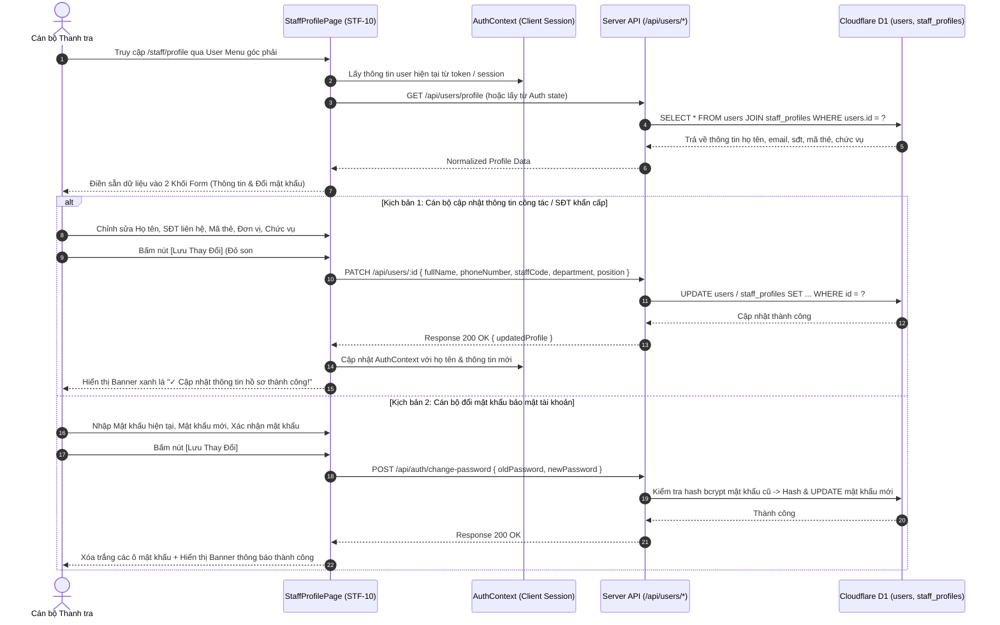

# STF-10 — Hồ Sơ Cán Bộ, Định Danh Công Tác & Thẻ Thanh Tra (Staff Profile & Operational Identity)

> **Tài liệu đặc tả màn hình chuẩn SSOT (Single Source of Truth) — DustGuard VN CivicTech Platform**  
> Trung tâm quản lý thông tin định danh công vụ của cán bộ thanh tra xây dựng/môi trường và giám sát viên địa bàn: thiết lập số hiệu Thẻ thanh tra viên (`staffCode` font-mono), đơn vị công tác, chức danh chuyên môn, đường dây nóng nhận cảnh báo khẩn cấp (SMS/Zalo khi bụi vượt ngưỡng), đổi mật khẩu an toàn tài khoản công vụ và tự động liên kết danh tính vào mục "Người lập biên bản" trên các văn bản in ấn chuẩn **Nghị định 30/2020/NĐ-CP**.

---

## 1. Screen Identity

| Thuộc tính | Giá trị SSOT | Ghi chú kỹ thuật |
|---|---|---|
| **Mã màn hình** | `STF-10` | Mã định danh chuẩn trong Design System |
| **Tên tiếng Việt** | Hồ sơ cán bộ & Định danh công tác | Nhãn hiển thị chính thức trên hệ thống |
| **Tên tiếng Anh** | Staff Profile & Operational Identity | Tên tiếng Anh đối ngoại & API Contract |
| **Đường dẫn (Route)** | `/staff/profile` | Canonical Route (Truy cập từ Avatar / Dropdown Menu) |
| **Component Path** | [`app/src/apps/staff/pages/profile/StaffProfilePage.jsx`](file:///d:/07-Competitions-Hackathons/unicef-dustguard/app/src/apps/staff/pages/profile/StaffProfilePage.jsx) | React 19 Client Component |
| **Backend Service / Route** | [`app/server/routes/api/users.js`](file:///d:/07-Competitions-Hackathons/unicef-dustguard/app/server/routes/api/users.js) | Express / Worker Hono User Controller |
| **API Client** | [`app/src/lib/api/request.js`](file:///d:/07-Competitions-Hackathons/unicef-dustguard/app/src/lib/api/request.js) | Method: `PATCH /users/:id`, `POST /auth/change-password` |
| **Layout bọc** | [`app/src/apps/staff/layout/StaffLayout.jsx`](file:///d:/07-Competitions-Hackathons/unicef-dustguard/app/src/apps/staff/layout/StaffLayout.jsx) | Sidebar 8 mục nghiệp vụ điều hành Staff |
| **Vai trò truy cập (Role)** | `staff`, `executive`, `admin` | Cán bộ Thanh tra, Giám sát viên, Trưởng ca |
| **Trạng thái thực thi** | **ACTIVE (Level 5 Production Coherent)** | Kết nối 100% CSDL D1 thật, Zero-Mock |

---

## 2. Mục Đích & Giá Trị Thực Tế

### 2.1. Mục đích thiết kế
Màn hình **STF-10** đóng vai trò là "Thẻ căn cước công vụ số" của cán bộ thanh tra trên toàn hệ thống DustGuard VN. Màn hình phục vụ 4 mục tiêu cốt lõi:
1. *Chuẩn hóa thông tin định danh công vụ*: Lưu trữ họ tên đầy đủ, mã số thẻ thanh tra viên (`staffCode`, ví dụ: `TT-HN-0428`), cơ quan đơn vị (`Đội Thanh tra Xây dựng & Đô thị Quận Thanh Xuân`) và chức vụ chuyên môn (`Thanh tra viên chính`).
2. *Đồng bộ trực tiếp vào văn bản pháp lý*: Tên cán bộ, số hiệu thẻ và chức vụ trên màn hình này sẽ tự động được điền vào mục *Người lập biên bản* trên toàn bộ các Biên bản kiểm tra hiện trường, Biên bản vi phạm hành chính và Báo cáo in ấn A4 chuẩn **Nghị định 30/2020/NĐ-CP**.
3. *Kênh liên lạc khẩn cấp nhận thông báo vượt ngưỡng*: Cập nhật số điện thoại cá nhân/công vụ để nhận tin nhắn cảnh báo tự động khi trạm đo ghi nhận nồng độ bụi vượt ngưỡng khẩn cấp ($PM10 > 150\,\mu\text{g/m}^3$ hoặc $PM2.5 > 100\,\mu\text{g/m}^3$).
4. *Bảo vệ an toàn tài khoản tác nghiệp*: Cho phép cán bộ chủ động đổi mật khẩu định kỳ, bảo đảm tính bất khả xâm phạm đối với tài khoản có thẩm quyền lập biên bản và giao nhiệm vụ cho nhà thầu.

### 2.2. Giá trị thực tế & Thay thế cách làm cũ (Civic Value)
- **Minh bạch hóa trách nhiệm cá nhân & Chống chối bỏ**: Trước đây, biên bản giấy thường ghi tay tên cán bộ, đôi khi chữ viết không rõ ràng hoặc sai số hiệu thẻ thanh tra. Với STF-10, mọi quyết định hành chính và biên bản xuất ra đều gắn chặt với mã thẻ công vụ đã được xác thực trong CSDL Cloudflare D1.
- **Khóa an toàn địa chỉ Email (`disabled`)**: Email đăng nhập công vụ (`staff.an@dustguard.vn`) bị khóa chỉnh sửa để tránh việc chuyển nhượng tài khoản trái phép, chỉ Quản trị viên hệ thống (Admin) mới có quyền cấp lại email.
- **Trải nghiệm lưu trữ mượt mà, tức thì**: Hiển thị rõ ràng Banner trạng thái (Thành công: Nền xanh lá `#F0FDF4`, Thất bại: Nền hồng đỏ `#FEF2F2`), tự động cập nhật ngay lập tức vào Session Context mà không bắt buộc cán bộ phải đăng nhập lại.

---

## 3. Đối Tượng Người Dùng & Hành Trình Thao Tác (User Journey)

### 3.1. Đối tượng sử dụng
- **Cán bộ thanh tra xây dựng / Môi trường trực tiếp**: Cập nhật thông tin công tác cá nhân, đổi mật khẩu định kỳ 3 tháng/lần.
- **Cán bộ giám sát địa bàn / Đội trưởng cơ động**: Xác nhận số hiệu thẻ thanh tra và địa bàn phụ trách để hệ thống tự động gán vụ việc phát sinh.

### 3.2. Sơ đồ hành trình tác nghiệp (Sequence Diagram & Core Flow)



---

## 4. Bố Cục Giao Diện & Phân Cấp Thông Tin (Information Hierarchy)

### 4.1. Khung dây giao diện tổng thể (ASCII Wireframe)

```text
+--------------------------------------------------------------------------------------------------------------------+
| [Staff Layout Header] Trang chính / Cài đặt                                        (🔔 8) [Cán bộ: Nguyễn Minh An] |
+--------------------------------------------------------------------------------------------------------------------+
|                                                                                                                    |
|  +--------------------------------------------------------------------------------------------------------------+  |
|  | Hồ Sơ Cán Bộ & Định Danh Công Tác                                                                            |  |
|  | Quản lý thông tin định danh, số hiệu thẻ thanh tra, đơn vị công tác và bảo mật tài khoản công vụ.            |  |
|  +--------------------------------------------------------------------------------------------------------------+  |
|                                                                                                                    |
|  [ ✓ Cập nhật thông tin hồ sơ cán bộ thành công! Dữ liệu đã đồng bộ vào biên bản NĐ 30/2020.                 ]    |
|                                                                                                                    |
|  +--------------------------------------------------------------------------------------------------------------+  |
|  | THÔNG TIN CÁ NHÂN & CÔNG TÁC CÔNG VỤ                                                                         |  |
|  +--------------------------------------------------------------------------------------------------------------+  |
|  | Họ và tên cán bộ *                               | Email đăng nhập công vụ (Khóa cố định)                     |  |
|  | [ Nguyễn Minh An                               ] | [ staff.an@dustguard.vn                                  ] |  |
|  |                                                  | 🔒 Liên hệ Quản trị viên nếu cần thay đổi email            |  |
|  |--------------------------------------------------+------------------------------------------------------------|  |
|  | Số điện thoại nhận tin khẩn cấp *                | Mã thẻ / Số hiệu Thanh tra viên (Font Mono)                |  |
|  | [ 0912 345 678                                 ] | [ TT-HN-0428                                             ] |  |
|  | (Dùng nhận SMS khi bụi vượt PM10 > 150 µg/m³)    | (In trực tiếp trên Biên bản kiểm tra A4)                   |  |
|  |--------------------------------------------------+------------------------------------------------------------|  |
|  | Đơn vị / Phòng ban công tác                      | Chức danh / Vị trí chuyên môn                              |  |
|  | [ Đội Thanh tra Xây dựng & Đô thị Q. Thanh Xuân ] | [ Thanh tra viên chính / Tổ trưởng Giám sát               ] |  |
|  +--------------------------------------------------------------------------------------------------------------+  |
|                                                                                                                    |
|  +--------------------------------------------------------------------------------------------------------------+  |
|  | BẢO MẬT & ĐỔI MẬT KHẨU TÀI KHOẢN (Tùy chọn)                                                                   |  |
|  +--------------------------------------------------------------------------------------------------------------+  |
|  | Mật khẩu hiện tại                                | Mật khẩu mới (Tối thiểu 8 ký tự, gồm số & ký tự đặc biệt)  |  |
|  | [ ••••••••••••                                 ] | [ ••••••••••••                                           ] |  |
|  |--------------------------------------------------+------------------------------------------------------------|  |
|  | Xác nhận mật khẩu mới                            |                                                            |  |
|  | [ ••••••••••••                                 ] | ⓘ Để trống nếu không muốn thay đổi mật khẩu              |  |
|  +--------------------------------------------------------------------------------------------------------------+  |
|                                                                                                                    |
|  +--------------------------------------------------------------------------------------------------------------+  |
|  | [ Lưu Thay Đổi ] (Nền đỏ son #B91C1C, min-h 44px)        [ Hủy bỏ ]                                           |  |
|  +--------------------------------------------------------------------------------------------------------------+  |
+--------------------------------------------------------------------------------------------------------------------+
```

### 4.2. Chi tiết phân cấp thông tin giao diện
1. **Header Khối Hồ Sơ**:
   - Tiêu đề cấp 1: "Hồ Sơ Cán Bộ & Định Danh Công Tác" (Font Black `#1C1917`, $24\text{px}$).
   - Mô tả ngắn gọn: "Quản lý thông tin định danh, số hiệu thẻ thanh tra, đơn vị công tác và bảo mật tài khoản công vụ."
2. **Banner Thông Báo Trạng Thái (Alert Banners)**:
   - *Banner Thành công*: Nền xanh lá `#F0FDF4`, viền `#BBF7D0`, chữ `#166534`, icon tích `✓`.
   - *Banner Thất bại*: Nền hồng đỏ `#FEF2F2`, viền `#FECACA`, chữ `#991B1B`, icon dấu `✕`.
3. **Thẻ 1 — Thông Tin Cá Nhân & Công Tác (Card Container)**:
   - **Họ và tên cán bộ (`fullName`)**: Trường bắt buộc `*`, hiển thị trên tiêu đề hệ thống và biên bản in.
   - **Email đăng nhập (`email`)**: Khóa xám `disabled` với màu nền `#F5F5F4`, có ghi chú an toàn "🔒 Liên hệ Quản trị viên nếu cần thay đổi".
   - **Số điện thoại khẩn cấp (`phoneNumber`)**: Định dạng số Việt Nam, dùng cho đường dây nóng nhận cảnh báo SMS/Zalo.
   - **Mã thẻ thanh tra viên (`staffCode`)**: Định dạng phông Mono in hoa (VD: `TT-HN-0428`), tự động in lên văn bản NĐ 30/2020.
   - **Đơn vị / Phòng ban (`department`)**: Tên cơ quan chủ quản (VD: `Đội Thanh tra Xây dựng & Đô thị Quận Thanh Xuân`).
   - **Chức danh / Vị trí (`position`)**: Chức vụ công vụ (VD: `Thanh tra viên chính / Tổ trưởng Giám sát`).
4. **Thẻ 2 — Đổi Mật Khẩu Bảo Mật Tài Khoản (Card Container)**:
   - 3 Ô nhập mật khẩu: *Mật khẩu hiện tại*, *Mật khẩu mới*, *Xác nhận mật khẩu mới*.
   - Ghi chú bảo mật: "Để trống các trường này nếu không có nhu cầu đổi mật khẩu."
5. **Khu vực Nút Hành Động (Action Footer)**:
   - Nút `[Lưu Thay Đổi]` (Màu đỏ son `#B91C1C`, chữ trắng đậm, chiều cao tối thiểu $44\text{px}$, hiển thị trạng thái `Đang lưu…` khi gửi request).
   - Nút `[Hủy bỏ]` (Nền trắng viền xám, reset form về trạng thái ban đầu).

---

## 5. Dữ Liệu & Hợp Đồng API / CSDL D1 (Data Contract)

### 5.1. Các Endpoints API Phân Hệ Hồ Sơ Cán Bộ

#### A. Cập nhật thông tin định danh cán bộ
```http
PATCH /api/users/:id
Content-Type: application/json
Authorization: Bearer <staff_jwt_token>

{
  "fullName": "Nguyễn Minh An",
  "phoneNumber": "0912345678",
  "staffCode": "TT-HN-0428",
  "department": "Đội Thanh tra Xây dựng & Đô thị Quận Thanh Xuân",
  "position": "Thanh tra viên chính"
}
```
**Response JSON SSOT**:
```json
{
  "success": true,
  "data": {
    "id": "usr_staff_01",
    "fullName": "Nguyễn Minh An",
    "email": "staff.an@dustguard.vn",
    "phoneNumber": "0912345678",
    "staffCode": "TT-HN-0428",
    "department": "Đội Thanh tra Xây dựng & Đô thị Quận Thanh Xuân",
    "position": "Thanh tra viên chính",
    "role": "staff"
  },
  "message": "Cập nhật hồ sơ thành công"
}
```

#### B. Đổi mật khẩu tài khoản công tác
```http
POST /api/auth/change-password
Content-Type: application/json
Authorization: Bearer <staff_jwt_token>

{
  "currentPassword": "MatKhauCu123!@",
  "newPassword": "MatKhauMoi456!@"
}
```
**Response JSON SSOT**:
```json
{
  "success": true,
  "data": null,
  "message": "Đổi mật khẩu thành công"
}
```

### 5.2. Các bảng D1 SQLite tham gia truy vấn (SSOT Schema)

```sql
-- 1. Bảng tài khoản người dùng chính (users)
CREATE TABLE IF NOT EXISTS users (
  id TEXT PRIMARY KEY,
  email TEXT UNIQUE NOT NULL,
  password_hash TEXT NOT NULL,
  full_name TEXT NOT NULL,
  phone_number TEXT,
  role TEXT NOT NULL DEFAULT 'staff' CHECK (role IN ('public', 'citizen', 'community', 'staff', 'executive', 'admin')),
  created_at DATETIME DEFAULT CURRENT_TIMESTAMP,
  updated_at DATETIME DEFAULT CURRENT_TIMESTAMP,
  deleted_at DATETIME
);

-- 2. Bảng thông tin định danh chuyên sâu cán bộ (staff_profiles)
CREATE TABLE IF NOT EXISTS staff_profiles (
  user_id TEXT PRIMARY KEY REFERENCES users(id) ON DELETE CASCADE,
  staff_code TEXT UNIQUE,
  department TEXT,
  position TEXT,
  assigned_district TEXT,
  assigned_ward TEXT,
  emergency_phone TEXT,
  created_at DATETIME DEFAULT CURRENT_TIMESTAMP,
  updated_at DATETIME DEFAULT CURRENT_TIMESTAMP
);

CREATE INDEX IF NOT EXISTS idx_staff_profiles_code ON staff_profiles(staff_code);
```

---

## 6. Hành Động Cốt Lõi (CTAs & Interactions)

| Hành động (CTA) | Vị trí kích hoạt | Màu sắc & Định dạng | Hành vi & Phản hồi hệ thống | Phân quyền (RBAC) |
|---|---|---|---|:---:|
| **`[Lưu Thay Đổi]`** | Chân Form trang hồ sơ | Nền đỏ son `#B91C1C`, chữ trắng đậm, `min-h-[44px]` | Gửi đồng thời `PATCH /api/users/:id` và `POST /api/auth/change-password` (nếu có nhập pass), hiển thị Banner xanh. | `staff`, `admin` |
| **`[Hủy bỏ]`** | Cạnh nút Lưu thay đổi | Nền trắng viền `#E7E5E4`, chữ đen đậm | Reset lại các ô input về giá trị ban đầu trong session. | `staff`, `admin` |
| **`[Xem trước định dạng biên bản]`** | Nút phụ trong khối thông tin | Nền xám nhạt `#F5F5F4`, chữ đen | Mở popover xem trước mẫu hiển thị tên & mã thẻ trên biên bản A4. | `staff` |

---

## 7. Quy Chuẩn UI/UX & Responsive (Design System Tokens)

### 7.1. Bảng màu Civic Tech High-Contrast (Không Glassmorphism)
- **Nền trang chính**: `#FAFAF9` (Stone-50 — Màu kem sáng văn phòng).
- **Nền Card Container**: `#FFFFFF` nguyên khối, viền `#E7E5E4` (Stone-200), bóng đổ nhẹ `shadow-2xs`.
- **Màu văn bản chính**: `#1C1917` (Stone-900 — Đen mực in sắc nét, độ tương phản $\ge 7:1$).
- **Màu trường bị khóa (`disabled`)**: Nền `#F5F5F4`, chữ `#78716C`, viền `#E7E5E4`, con trỏ chuột `cursor-not-allowed`.
- **Màu nút hành động chính**: Nền đỏ son `#B91C1C`, hover `#991B1B`, chữ trắng nổi bật.

### 7.2. Chuẩn hiển thị Responsive Đa Màn Hình
- **Laptop 14-inch (1366x768, 1440x900, 1536x864 scale 125%)**:
  - Các ô nhập liệu trong 2 Thẻ dàn 2 cột cân đối (`grid grid-cols-2 gap-4`).
  - Thanh Header và các nút không bị ngắt dòng (`whitespace-nowrap`).
- **Tablet (768px - 1024px)**:
  - Form duy trì lưới 2 cột hoặc chuyển sang 1 cột linh hoạt với padding thoải mái.
- **Mobile (360px - 430px)**:
  - Tất cả các trường nhập liệu chuyển thành 1 cột dọc (`grid-cols-1`).
  - Nút `[Lưu Thay Đổi]` dàn đều $100\%$ chiều rộng màn hình, chiều cao đảm bảo $\ge 44\text{px}$ để bấm chính xác trên màn hình cảm ứng.

---

## 8. Bẫy Lỗi Thường Gặp & Hướng Dẫn Kiểm Thử (Verification)

### 8.1. Các bẫy lỗi tiềm ẩn & Cơ chế phòng ngừa
1. **Lỗi không khớp xác nhận mật khẩu mới**: Cán bộ gõ nhầm ở ô xác nhận mật khẩu.
   - *Khắc phục*: Validate ngay tại Client trước khi gửi API: `if (newPassword !== confirmPassword) setError("Mật khẩu mới không trùng khớp")`.
2. **Lỗi mất đồng bộ Session sau khi đổi tên**: Cập nhật DB thành công nhưng Header góc phải vẫn hiện tên cũ.
   - *Khắc phục*: Gọi hàm `updateUserSession(updatedProfile)` từ `AuthContext` ngay khi nhận HTTP 200 từ API.
3. **Lỗi trùng lặp mã thẻ cán bộ (`staffCode`)**: Cán bộ nhập mã thẻ đã được cấp cho người khác.
   - *Khắc phục*: Backend D1 kiểm tra `UNIQUE constraint` và trả về lỗi RFC 7807 thân thiện: *"Mã thẻ thanh tra TT-HN-0428 đã tồn tại trên hệ thống"*.

### 8.2. Bộ lệnh kiểm thử nhanh PowerShell CLI (< 0.5s)

```powershell
# 1. Kiểm thử xác thực Auth & User Profile Management
node --test app/tests/auth-user-management-audit.test.js

# 2. Kiểm thử bảo mật đổi mật khẩu & RBAC
node --test app/tests/admin-executive-rbac-penetration.test.js

# 3. Kiểm thử Design System Tokens & Responsive Form
node --test app/tests/design-system-tokens.test.js
```
