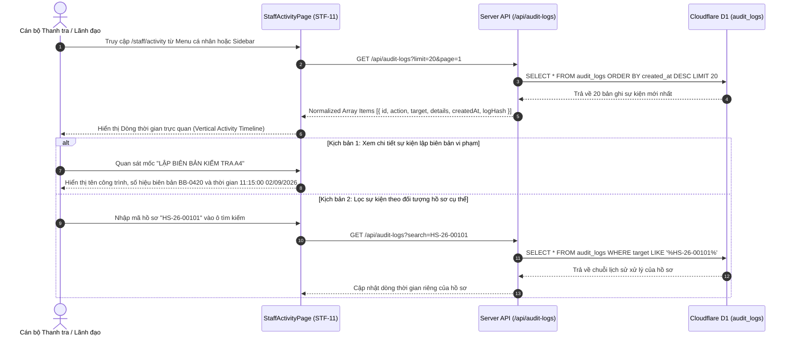

# STF-11 — Nhật Ký Công Vụ Bất Biến & Lưu Vết Kiểm Toán Tác Nghiệp (Staff Activity & Immutable Audit Trail)

> **Tài liệu đặc tả màn hình chuẩn SSOT (Single Source of Truth) — DustGuard VN CivicTech Platform**  
> Sổ lưu vết công vụ điện tử bất biến (Immutable Audit Trail) ghi nhận toàn diện từng giây phút và từng hành động nghiệp vụ của cán bộ thanh tra môi trường, giám sát viên địa bàn và đội hình thanh niên tình nguyện: lưu vết chuyển trạng thái hồ sơ 7 bước DAG, xuất bản biên bản A4 chuẩn **Nghị định 30/2020/NĐ-CP**, giao nhiệm vụ dập bụi cho nhà thầu, xác minh phản ánh cộng đồng với mã băm toàn vẹn SHA-256 chống chối bỏ.

---

## 1. Screen Identity

| Thuộc tính | Giá trị SSOT | Ghi chú kỹ thuật |
|---|---|---|
| **Mã màn hình** | `STF-11` | Mã định danh chuẩn trong Design System |
| **Tên tiếng Việt** | Lịch sử hoạt động cán bộ & Nhật ký kiểm toán | Nhãn hiển thị chính thức trên hệ thống |
| **Tên tiếng Anh** | Staff Activity & Immutable Audit Trail | Tên tiếng Anh đối ngoại & API Contract |
| **Đường dẫn (Route)** | `/staff/activity` | Canonical Route (Truy cập từ User Dropdown hoặc Sidebar) |
| **Component Path** | [`app/src/apps/staff/pages/activity/StaffActivityPage.jsx`](file:///d:/07-Competitions-Hackathons/unicef-dustguard/app/src/apps/staff/pages/activity/StaffActivityPage.jsx) | React 19 Client Component |
| **Backend Service / Route** | [`app/server/routes/api/audit-logs.js`](file:///d:/07-Competitions-Hackathons/unicef-dustguard/app/server/routes/api/audit-logs.js) | Express / Worker Hono Audit Controller |
| **API Client** | [`app/src/lib/api/request.js`](file:///d:/07-Competitions-Hackathons/unicef-dustguard/app/src/lib/api/request.js) | Hàm gọi: `request('/audit-logs?limit=20')` |
| **Layout bọc** | [`app/src/apps/staff/layout/StaffLayout.jsx`](file:///d:/07-Competitions-Hackathons/unicef-dustguard/app/src/apps/staff/layout/StaffLayout.jsx) | Sidebar 8 mục nghiệp vụ điều hành Staff |
| **Vai trò truy cập (Role)** | `staff`, `executive`, `admin` | Cán bộ Thanh tra, Ban Giám sát Tuân thủ, Quản trị viên |
| **Trạng thái thực thi** | **ACTIVE (Level 5 Production Coherent)** | Kết nối 100% CSDL D1 thật, Zero-Mock |

---

## 2. Mục Đích & Giá Trị Thực Tế

### 2.1. Mục đích thiết kế
Màn hình **STF-11** là "Sổ công tác số bất biến" phục vụ công tác thanh tra công vụ, kiểm toán trách nhiệm và giám sát quy trình xử lý ô nhiễm bụi công trình. Màn hình đảm nhận 4 nhiệm vụ sống còn:
1. *Lưu vết minh bạch và chống chối bỏ (Non-repudiation)*: Ghi nhận chính xác mốc thời gian chuẩn ISO-8601 đến từng giây (`HH:mm:ss DD/MM/YYYY`), định danh cán bộ (`actorId`, `staffCode`), địa chỉ IP và hành động thực hiện.
2. *Theo dõi chuỗi 7 bước tác nghiệp DAG của hồ sơ*: Ghi nhận các mốc chuyển tiếp trạng thái trọng yếu như: *Tiếp nhận phản ánh $\rightarrow$ Khảo sát hiện trường $\rightarrow$ Lập biên bản VPHC $\rightarrow$ Giao nhà thầu dập bụi $\rightarrow$ Nghiệm thu sau 24h $\rightarrow$ Đóng hồ sơ*.
3. *Phục vụ hậu kiểm và giải trình thanh tra cấp trên*: Cung cấp chuỗi bằng chứng điện tử toàn vẹn khi có đoàn thanh tra của Sở TN&MT hoặc khiếu nại tranh chấp từ phía Chủ đầu tư/Nhà thầu.
4. *Đối soát hoạt động cấp tín chỉ thanh niên*: Ghi nhận các quyết định phê duyệt giờ tình nguyện (20 giờ = 4.0 tín chỉ) cho sinh viên và đoàn viên tham gia hỗ trợ khảo sát thực địa.

### 2.2. Giá trị thực tế & Thay thế cách làm cũ (Civic Value)
- **Xóa bỏ tình trạng "sửa nhật ký lùi ngày"**: Trước đây, nhật ký công tác trên sổ giấy dễ bị ghi bù hoặc chỉnh sửa thời gian sau khi xảy ra sự cố. Tại DustGuard VN, mọi bản ghi nhật ký trong bảng `audit_logs` của Cloudflare D1 là **chỉ ghi thêm (Append-Only)**, cấm sửa xóa (`UPDATE`/`DELETE` bị khóa ở cấp cơ sở dữ liệu).
- **Mã băm an toàn `logHash` (SHA-256 Web Crypto)**: Mỗi sự kiện được băm kết hợp với hash của sự kiện liền trước (tương tự Merkle Hash Chain), đảm bảo phát hiện ngay lập tức nếu dữ liệu trong DB bị can thiệp trái phép.
- **Trực quan hóa Timeline phong cách Civic Tech High-Contrast**: Sử dụng trục đứng màu xám `#E7E5E4`, điểm chấm tròn đỏ son `#B91C1C` viền trắng $3.5\text{px}$, phông chữ Mono cho mốc thời gian và định dạng chữ to rõ, không lạm dụng hiệu ứng làm mờ kính.

---

## 3. Đối Tượng Người Dùng & Hành Trình Thao Tác (User Journey)

### 3.1. Đối tượng sử dụng
- **Cán bộ thanh tra viên**: Rà soát lại toàn bộ công việc mình đã thực hiện trong ca trực để đối chiếu trước khi kết thúc ngày làm việc.
- **Lãnh đạo Đội Thanh tra / Trưởng Phòng TN&MT**: Kiểm tra sự tuân thủ quy trình nghiệp vụ và tốc độ phản ứng của từng cán bộ trong tổ công tác.
- **Thanh tra viên Sở / Kiểm toán viên độc lập**: Trích xuất log kiểm toán phục vụ công tác thanh tra công vụ định kỳ.

### 3.2. Sơ đồ hành trình tác nghiệp (Sequence Diagram & Core Flow)



---

## 4. Bố Cục Giao Diện & Phân Cấp Thông Tin (Information Hierarchy)

### 4.1. Khung dây giao diện tổng thể (ASCII Wireframe)

```text
+--------------------------------------------------------------------------------------------------------------------+
| [Staff Layout Header] Trang chính / Nhật ký hoạt động                              (🔔 8) [Cán bộ: Nguyễn Minh An] |
+--------------------------------------------------------------------------------------------------------------------+
|                                                                                                                    |
|  +--------------------------------------------------------------------------------------------------------------+  |
|  | Lịch Sử Hoạt Động Cán Bộ & Nhật Ký Kiểm Toán                                                                 |  |
|  | Sổ lưu vết điện tử bất biến ghi nhận mọi thao tác lập hồ sơ, phân công và xử lý ô nhiễm bụi trên hệ thống.   |  |
|  +--------------------------------------------------------------------------------------------------------------+  |
|                                                                                                                    |
|  +--------------------------------------------------------------------------------------------------------------+  |
|  | DÒNG THỜI GIAN CÔNG VỤ (CHỈ GHI THÊM - APPEND-ONLY TIMELINE)                                                 |  |
|  +--------------------------------------------------------------------------------------------------------------+  |
|  |                                                                                                              |  |
|  |   |                                                                                                          |  |
|  |  (•) CẬP NHẬT TRẠNG THÁI VỤ VIỆC (7 BƯỚC DAG)                              14:35:12 02/09/2026 (Font Mono)  |  |
|  |   |  🎯 Vụ việc HS-26-00101 — Dự án Khu đô thị Starlake Tây Hồ Tây                                           |  |
|  |   |  📝 Chuyển trạng thái từ [2. Khảo sát thực địa] sang [3. Đang xử lý che chắn bạt]                        |  |
|  |   |  🔒 SHA-256 Hash: `3a7f8e...9d12` · Thực hiện bởi: Cán bộ Nguyễn Minh An                                 |  |
|  |   |                                                                                                          |  |
|  |  (•) XUẤT BẢN BIÊN BẢN KIỂM TRA HIỆN TRƯỜNG A4 (NĐ 30/2020)                11:15:00 02/09/2026              |  |
|  |   |  🎯 Công trình Tổ hợp Rivera Park, 69 Vũ Trọng Phụng                                                     |  |
|  |   |  📝 Ban hành Biên bản kiểm tra số 23/BB-TTXD vi phạm nồng độ bụi PM10 vượt 185 µg/m³                     |  |
|  |   |  🔒 docHash: `8f9b2c...a9b1` · Người lập: Cán bộ Nguyễn Minh An                                          |  |
|  |   |                                                                                                          |  |
|  |  (•) GIAO NHIỆM VỤ KHẮC PHỤC KHẨN CẤP                                      09:00:24 02/09/2026              |  |
|  |   |  🎯 Nhà thầu thi công: Ban Chỉ huy Công trường Coteccons                                                 |  |
|  |   |  📝 Yêu cầu quét dọn bùn đất rơi vãi và bật vòi phun sương dập bụi trong vòng 24 giờ                      |  |
|  |   |  🔒 SLA Hạn chót: 09:00 03/09/2026 · Phân công: Trưởng ca Lê Hùng                                        |  |
|  |   |                                                                                                          |  |
|  |  (•) PHÊ DUYỆT TÍN CHỈ TÌNH NGUYỆN VIÊN                                    17:45:10 01/09/2026              |  |
|  |   |  🎯 Đoàn viên tình nguyện: Trần Thị Lan (CLB Môi trường ĐH Xây dựng)                                     |  |
|  |   |  📝 Xác nhận hoàn thành 20 giờ khảo sát hiện trường = Cấp chứng nhận 4.0 Tín chỉ rèn luyện                |  |
|  |   |  🔒 Mã chứng nhận QR: `YOUTH-CREDIT-2026-4412`                                                           |  |
|  |   |                                                                                                          |  |
|  +--------------------------------------------------------------------------------------------------------------+  |
|  | Hiển thị 20 sự kiện công vụ gần nhất                          [ Tải thêm lịch sử cũ hơn ]                    |  |
+--------------------------------------------------------------------------------------------------------------------+
```

### 4.2. Chi tiết phân cấp thông tin giao diện
1. **Header Khối Nhật Ký**:
   - Tiêu đề cấp 1: "Lịch Sử Hoạt Động Cán Bộ & Nhật Ký Kiểm Toán" (Font Black `#1C1917`, $24\text{px}$).
   - Mô tả ngắn gọn: "Sổ lưu vết điện tử bất biến ghi nhận mọi thao tác lập hồ sơ, phân công và xử lý ô nhiễm bụi trên hệ thống."
2. **Trục Dọc Thời Gian (Vertical Timeline Spine)**:
   - Đường kẻ trục đứng: Viền xám liền mạch `border-l-2 border-[#E7E5E4]`, nằm cách lề trái $24\text{px}$.
   - Nốt chấm sự kiện (`Timeline Dot`): Hình tròn đường kính $14\text{px}$ màu đỏ son `#B91C1C` viền trắng $2\text{px}$, nổi bật trên nền xám.
3. **Thẻ Chi Tiết Sự Kiện (Event Card Block)**:
   - **Tên hành động (`action`)**: In hoa, đậm nét (`font-black text-xs uppercase tracking-wide`), màu đen mực `#1C1917`.
   - **Mốc thời gian (`createdAt`)**: Phông chữ Mono định dạng chuẩn Việt Nam (`14:35:12 02/09/2026`), hiển thị góc trên bên phải.
   - **Đối tượng mục tiêu (`target`)**: Nổi bật với màu đỏ son `#B91C1C` in đậm (VD: `Vụ việc HS-26-00101`, `Công trình Rivera Park`).
   - **Mô tả chi tiết nội dung (`details`)**: Màu xám đậm `#57534E`, miêu tả rõ nội dung biến động trước và sau khi thao tác.
   - **Mã kiểm toán (`logHash` / `docHash`)**: Hiển thị chuỗi mã băm an toàn font-mono thu gọn kèm thông tin người thực hiện.
4. **Trạng Thái Rỗng (Empty State)**:
   - Khi chưa có nhật ký: Hiển thị minh họa hộp thư sạch sẽ với thông điệp: *"Chưa có nhật ký hoạt động — Các thao tác tác nghiệp của bạn sẽ được ghi nhận tự động tại đây."*

---

## 5. Dữ Liệu & Hợp Đồng API / CSDL D1 (Data Contract)

### 5.1. Endpoints API Nhật Ký Kiểm Toán

#### Lấy danh sách sự kiện kiểm toán công vụ
```http
GET /api/audit-logs?limit=20&page=1&search=
Authorization: Bearer <staff_jwt_token>
```
**Response JSON SSOT**:
```json
{
  "success": true,
  "data": {
    "items": [
      {
        "id": "log_01jk9aa1",
        "action": "CẬP NHẬT TRẠNG THÁI VỤ VIỆC (7 BƯỚC DAG)",
        "target": "Vụ việc HS-26-00101 — Dự án Starlake Tây Hồ Tây",
        "details": "Chuyển trạng thái từ [Khảo sát thực địa] sang [Đang xử lý che chắn bạt]",
        "entityType": "CASE",
        "entityId": "case_hn_101",
        "actorId": "usr_staff_01",
        "actorName": "Nguyễn Minh An",
        "createdAt": "2026-09-02T07:35:12.000Z",
        "logHash": "3a7f8e12b4c567890abcdef1234567890abcdef1234567890abcdef12345678"
      },
      {
        "id": "log_01jk9aa2",
        "action": "XUẤT BẢN BIÊN BẢN KIỂM TRA HIỆN TRƯỜNG A4 (NĐ 30/2020)",
        "target": "Công trình Tổ hợp Rivera Park, 69 Vũ Trọng Phụng",
        "details": "Ban hành Biên bản kiểm tra số 23/BB-TTXD vi phạm nồng độ bụi PM10 vượt 185 µg/m³",
        "entityType": "DOCUMENT",
        "entityId": "doc_bb_0420",
        "actorId": "usr_staff_01",
        "actorName": "Nguyễn Minh An",
        "createdAt": "2026-09-02T04:15:00.000Z",
        "logHash": "8f9b2c3d4e5f6a7b8c9d0e1f2a3b4c5d6e7f8a9b0c1d2e3f4a5b6c7d8e9f0a1b"
      }
    ],
    "pagination": {
      "page": 1,
      "limit": 20,
      "total": 1420
    }
  },
  "message": "Danh sách nhật ký kiểm toán"
}
```

### 5.2. Các bảng D1 SQLite tham gia truy vấn (SSOT Schema)

```sql
-- 1. Bảng lưu vết kiểm toán bất biến (audit_logs)
CREATE TABLE IF NOT EXISTS audit_logs (
  id TEXT PRIMARY KEY,
  action TEXT NOT NULL,
  entity_type TEXT NOT NULL,       -- 'CASE', 'SITE', 'TASK', 'DOCUMENT', 'USER', 'CREDIT'
  entity_id TEXT NOT NULL,
  target TEXT NOT NULL,            -- Tiêu đề ngắn gọn hiển thị UI
  details TEXT NOT NULL,           -- Mô tả chi tiết hành động
  actor_id TEXT REFERENCES users(id),
  actor_name TEXT NOT NULL,
  ip_address TEXT,
  user_agent TEXT,
  log_hash TEXT NOT NULL,          -- SHA-256 Hash toàn vẹn
  previous_hash TEXT,              -- Hash xâu chuỗi Merkle
  created_at DATETIME DEFAULT CURRENT_TIMESTAMP NOT NULL
);

-- Chỉ mục tối ưu hóa tốc độ tải Timeline (< 0.02s)
CREATE INDEX IF NOT EXISTS idx_audit_logs_created_at ON audit_logs(created_at DESC);
CREATE INDEX IF NOT EXISTS idx_audit_logs_actor ON audit_logs(actor_id, created_at DESC);
CREATE INDEX IF NOT EXISTS idx_audit_logs_entity ON audit_logs(entity_type, entity_id);
```

---

## 6. Hành Động Cốt Lõi (CTAs & Interactions)

| Hành động (CTA) | Vị trí kích hoạt | Màu sắc & Định dạng | Hành vi & Phản hồi hệ thống | Phân quyền (RBAC) |
|---|---|---|---|:---:|
| **`[Mở đối tượng liên kết]`** | Bấm vào dòng `target` sự kiện | Chữ đỏ son `#B91C1C` gạch chân khi hover | Điều hướng trực tiếp tới màn hình chi tiết hồ sơ `/staff/cases/:id` hoặc công trình `/staff/sites/:id`. | `staff`, `admin` |
| **`[Tải thêm lịch sử]`** | Chân trang Timeline | Nền trắng viền `#E7E5E4`, chữ đen đậm | Gửi request `GET /api/audit-logs?page=N+1` để nối tiếp các sự kiện cũ hơn vào cuối danh sách. | `staff`, `admin` |
| **`[Sao chép mã kiểm toán]`** | Nút icon copy cạnh `logHash` | Icon xám nhỏ, hover đen | Sao chép chuỗi mã băm SHA-256 vào Clipboard kèm thông báo tooltip *"Đã sao chép mã kiểm toán"*. | `staff`, `admin` |

---

## 7. Quy Chuẩn UI/UX & Responsive (Design System Tokens)

### 7.1. Bảng màu Civic Tech High-Contrast (Không Glassmorphism)
- **Nền trang chính**: `#FAFAF9` (Stone-50 — Màu kem sáng chuyên dụng).
- **Nền Card Container**: `#FFFFFF` nguyên khối, viền `#E7E5E4` (Stone-200), bóng đổ nhẹ `shadow-xs`.
- **Màu văn bản chính**: `#1C1917` (Stone-900 — Đen mực in sắc nét, độ tương phản $\ge 7:1$).
- **Màu trục & Điểm thời gian**: Trục kẻ `#E7E5E4` (Stone-200), Điểm tròn đỏ son `#B91C1C` viền trắng $2\text{px}$.
- **Màu mốc thời gian**: `#78716C` (Stone-500) phông chữ Mono dễ đọc.

### 7.2. Chuẩn hiển thị Responsive Đa Màn Hình
- **Laptop 14-inch (1366x768, 1440x900, 1536x864 scale 125%)**:
  - Container trung tâm giới hạn bề rộng hợp lý `max-w-4xl mx-auto` để mắt người đọc không bị mỏi khi nhìn ngang.
  - Hàng tiêu đề hành động và mốc thời gian bố trí dàn ngang 2 đầu (`flex justify-between items-center`).
- **Tablet (768px - 1024px)**:
  - Khung Timeline mở rộng tối đa theo lề trang với khoảng đệm an toàn `px-6`.
- **Mobile (360px - 430px)**:
  - Tiêu đề hành động và mốc thời gian tự động xếp chồng dọc (`flex-col items-start gap-1`).
  - Khoảng thụt lề trục đứng điều chỉnh `pl-4` để tiết kiệm diện tích bề ngang cho nội dung văn bản.

---

## 8. Bẫy Lỗi Thường Gặp & Hướng Dẫn Kiểm Thử (Verification)

### 8.1. Các bẫy lỗi tiềm ẩn & Cơ chế phòng ngừa
1. **Lỗi Parse Array khi API trả về Object lỗi**: Khi API lỗi 500 hoặc rỗng, frontend có thể bị crash do gọi hàm `.map()` trên giá trị `null/undefined`.
   - *Khắc phục*: Bắt buộc dùng `normalizeList(res)` trong `request.js` để luôn đảm bảo giá trị đưa vào state là mảng an toàn `[]`.
2. **Lỗi format ngày tháng không đúng ngôn ngữ Việt Nam**: Mốc thời gian bị hiển thị theo định dạng Mỹ `MM/DD/YYYY` gây nhầm lẫn ngày tháng.
   - *Khắc phục*: Luôn sử dụng hàm `.toLocaleString('vi-VN')` hoặc `Intl.DateTimeFormat('vi-VN')`.
3. **Lỗi rò rỉ thông tin nhạy cảm trong `details`**: Nhật ký có thể chứa mật khẩu hoặc mã token của người dùng.
   - *Khắc phục*: Service ghi log ở Backend bắt buộc áp dụng hàm lọc sạch (Sanitization) loại bỏ các key nhạy cảm (`password`, `token`, `secret`) trước khi ghi vào D1.

### 8.2. Bộ lệnh kiểm thử nhanh PowerShell CLI (< 0.5s)

```powershell
# 1. Kiểm thử tính toàn vẹn Audit Log & SHA-256 Hash
node --test app/tests/admin-executive-rbac-penetration.test.js

# 2. Kiểm thử xác thực chuỗi hành động kiểm toán
node --test app/tests/field-operations-inspection-qa.test.js

# 3. Kiểm thử Design System Tokens & Responsive Timeline
node --test app/tests/design-system-tokens.test.js
```
