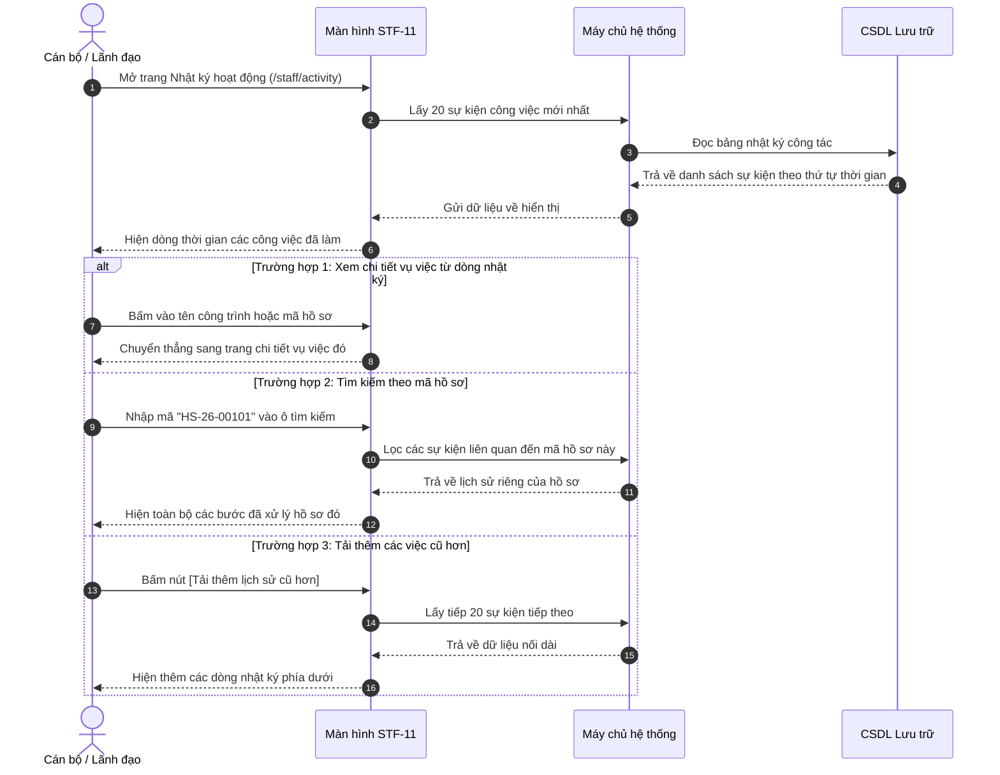

# STF-11 — Sổ Nhật Ký Công Tác & Lịch Sử Tác Nghiệp (Lưu Vết Công Vụ Minh Bạch)

> **Tài liệu hướng dẫn & đặc tả màn hình — Hệ thống DustGuard VN**  
> Sổ công tác điện tử ghi nhận trung thực mọi việc cán bộ đã làm theo đúng giờ phút thực tế: từ tiếp nhận phản ánh, khảo sát hiện trường, lập biên bản kiểm tra, giao việc dập bụi cho nhà thầu đến phê duyệt giờ tình nguyện cho thanh niên. Dữ liệu chỉ ghi thêm và không thể sửa xóa gian lận, phục vụ thanh tra và giải trình khi cần.

---

## 1. Thông Tin Màn Hình (Screen Identity)

| Mục | Nội dung | Giải thích dễ hiểu |
|---|---|---|
| **Mã màn hình** | `STF-11` | Mã viết tắt để tra cứu nhanh trong tài liệu |
| **Tên tiếng Việt** | **Sổ nhật ký công tác & lịch sử tác nghiệp** | Tên gọi hiển thị trên thanh menu |
| **Tên tiếng Anh** | Staff Activity & Audit Log | Tên dùng khi kết nối kỹ thuật |
| **Đường dẫn (URL)** | `/staff/activity` | Địa chỉ trang web trên trình duyệt |
| **File giao diện** | [`app/src/apps/staff/pages/activity/StaffActivityPage.jsx`](file:///d:/07-Competitions-Hackathons/unicef-dustguard/app/src/apps/staff/pages/activity/StaffActivityPage.jsx) | File mã nguồn hiển thị giao diện |
| **File xử lý dữ liệu** | [`app/server/routes/api/audit-logs.js`](file:///d:/07-Competitions-Hackathons/unicef-dustguard/app/server/routes/api/audit-logs.js) | File máy chủ ghi nhận và đọc nhật ký |
| **Ai được dùng?** | Cán bộ thanh tra, người trực ca, đoàn kiểm tra, lãnh đạo | Để xem lại lịch sử các công việc đã thực hiện |
| **Tình trạng kết nối** | **Đang hoạt động tốt** | Đọc dữ liệu thật từ hệ thống lưu trữ |

---

## 2. Mục Đích & Nghiệp Vụ Thực Tế

### 2.1. Cán bộ dùng màn hình này để làm gì?
Màn hình đóng vai trò là "Sổ ghi chép công tác điện tử" minh bạch, giúp:
1. **Lưu lại đầy đủ mọi việc đã làm trong ngày**:
   - Ghi nhận chính xác từng giây phút: Ai đã làm gì, vào lúc mấy giờ, trên công trình nào.
   - Ví dụ: Cán bộ Nguyễn Minh An chuyển trạng thái hồ sơ lúc 14:35, lập biên bản vi phạm lúc 11:15, giao việc dập bụi lúc 09:00.
2. **Theo dõi tiến độ xử lý hồ sơ qua từng bước**:
   - Từ lúc tiếp nhận tin báo $\rightarrow$ Đi kiểm tra hiện trường $\rightarrow$ Lập biên bản $\rightarrow$ Giao nhà thầu che bạt dập bụi $\rightarrow$ Nghiệm thu sau 24h $\rightarrow$ Đóng hồ sơ.
3. **Phục vụ giải trình và thanh tra cấp trên**:
   - Khi có khiếu nại từ nhà thầu hoặc đoàn thanh tra kiểm tra đột xuất, cán bộ mở màn hình này ra để đối chiếu toàn bộ tiến trình xử lý minh bạch từ đầu đến cuối.
4. **Theo dõi việc duyệt giờ tình nguyện cho thanh niên**:
   - Ghi lại các lần phê duyệt giờ tình nguyện (ví dụ: hoàn thành 20 giờ khảo sát = 4.0 tín chỉ rèn luyện) cho sinh viên và đoàn viên.

### 2.2. Giá trị thực tế thay thế cách làm cũ
- **Không thể ghi bù lùi ngày**: Trước đây ghi sổ tay dễ bị viết bù sau khi xảy ra sự cố. Trong hệ thống này, máy tính tự ghi nhận thời gian thực và **tuyệt đối không cho phép ai sửa hoặc xóa nhật ký**.
- **Có mã an toàn chống làm giả**: Mỗi dòng nhật ký đều có một đoạn mã an toàn kèm theo, nếu ai đó cố tình can thiệp vào dữ liệu máy chủ thì hệ thống sẽ phát hiện ra ngay lập tức.
- **Dòng thời gian dễ nhìn**: Trục thời gian dạng cây dọc với chấm tròn đỏ nổi bật, xem lướt qua là hiểu ngay diễn biến công việc trong ngày.

---

## 3. Đối Tượng Người Dùng & Các Bước Thực Hiện

### 3.1. Ai sử dụng màn hình này?
- **Cán bộ thanh tra viên**: Xem lại các việc mình đã hoàn thành trong ca trực trước khi bàn giao ca.
- **Tổ trưởng ca trực / Lãnh đạo**: Kiểm tra xem cấp dưới đã xử lý các tin báo ô nhiễm nhanh hay chậm.
- **Đoàn thanh tra kiểm tra công vụ**: Trích xuất lịch sử xử lý các vụ việc để kiểm tra tính tuân thủ quy trình.

### 3.2. Sơ đồ các bước xử lý hàng ngày



---

## 4. Bố Cục Giao Diện & Hình Minh Họa Dễ Hiểu (Wireframe)

### 4.1. Khung nhìn tổng thể trên màn hình máy tính (14 inch trở lên)

```text
+--------------------------------------------------------------------------------------------------------------------+
| [THANH TIÊU ĐỀ TRÊN CÙNG]                                                          (🔔 8) [Cán bộ: Nguyễn Minh An] |
+--------------------------------------------------------------------------------------------------------------------+
|                                                                                                                    |
|  +--------------------------------------------------------------------------------------------------------------+  |
|  | Lịch Sử Hoạt Động Cán Bộ & Nhật Ký Kiểm Toán                                                                 |  |
|  | Sổ ghi chép điện tử lưu lại mọi thao tác lập hồ sơ, phân công và xử lý ô nhiễm bụi trên hệ thống.             |  |
|  +--------------------------------------------------------------------------------------------------------------+  |
|                                                                                                                    |
|  +--------------------------------------------------------------------------------------------------------------+  |
|  | DÒNG THỜI GIAN CÔNG TÁC (TỰ ĐỘNG GHI NHẬN - KHÔNG THỂ SỬA XÓA)                                                |  |
|  +--------------------------------------------------------------------------------------------------------------+  |
|  |                                                                                                              |  |
|  |   |                                                                                                          |  |
|  |  (•) CẬP NHẬT TIẾN ĐỘ HỒ SƠ VỤ VIỆC                                         14:35:12 02/09/2026 (Giờ thực)   |  |
|  |   |  🎯 Vụ việc HS-26-00101 — Dự án Khu đô thị Starlake Tây Hồ Tây                                           |  |
|  |   |  📝 Chuyển trạng thái: Từ [Khảo sát thực địa] sang [Đang xử lý che chắn bạt]                             |  |
|  |   |  🔒 Mã kiểm tra: `3a7f8e...9d12` · Người thực hiện: Cán bộ Nguyễn Minh An                                |  |
|  |   |                                                                                                          |  |
|  |  (•) BAN HÀNH BIÊN BẢN KIỂM TRA HIỆN TRƯỜNG A4                             11:15:00 02/09/2026              |  |
|  |   |  🎯 Công trình: Tổ hợp Thương mại Rivera Park, 69 Vũ Trọng Phụng                                         |  |
|  |   |  📝 Đã lập Biên bản kiểm tra số 23/BB-TTXD vi phạm nồng độ bụi PM10 vượt 185 µg/m³                       |  |
|  |   |  🔒 Mã kiểm tra: `8f9b2c...a9b1` · Người lập: Cán bộ Nguyễn Minh An                                      |  |
|  |   |                                                                                                          |  |
|  |  (•) GIAO NHIỆM VỤ KHẮC PHỤC DẬP BỤI CHO NHÀ THẦU                           09:00:24 02/09/2026              |  |
|  |   |  🎯 Đơn vị nhận: Ban Chỉ huy Công trường Coteccons                                                       |  |
|  |   |  📝 Yêu cầu quét dọn bùn đất rơi vãi và bật vòi phun nước dập bụi trong vòng 24 giờ                      |  |
|  |   |  🔒 Hạn chót: 09:00 ngày 03/09/2026 · Phân công bởi: Trưởng ca Lê Hùng                                   |  |
|  |   |                                                                                                          |  |
|  |  (•) DUYỆT TÍN CHỈ TÌNH NGUYỆN CHO THANH NIÊN                               17:45:10 01/09/2026              |  |
|  |   |  🎯 Tình nguyện viên: Trần Thị Lan (CLB Môi trường Sinh viên)                                            |  |
|  |   |  📝 Xác nhận hoàn thành 20 giờ khảo sát = Cấp giấy chứng nhận 4.0 Tín chỉ rèn luyện                      |  |
|  |   |  🔒 Mã chứng nhận: `YOUTH-CREDIT-2026-4412`                                                              |  |
|  |   |                                                                                                          |  |
|  +--------------------------------------------------------------------------------------------------------------+  |
|  | Đang xem 20 sự kiện gần nhất                                  [ Tải thêm lịch sử cũ hơn ]                    |  |
|  +--------------------------------------------------------------------------------------------------------------+  |
+--------------------------------------------------------------------------------------------------------------------+
```

### 4.2. Giải thích chi tiết các thành phần giao diện
1. **Trục dọc thời gian ở giữa**:
   - Trục đường kẻ màu xám nối liền các mốc thời gian.
   - Mỗi việc làm là một chấm tròn đỏ son `#B91C1C` viền trắng nổi bật.
2. **Nội dung từng dòng nhật ký**:
   - **Tên hành động**: In hoa đậm nét (ví dụ: `CẬP NHẬT TIẾN ĐỘ HỒ SƠ`, `BAN HÀNH BIÊN BẢN`).
   - **Giờ phút thực hiện**: Hiển thị góc trên bên phải theo giờ Việt Nam (`14:35:12 02/09/2026`).
   - **Công trình / Vụ việc liên quan**: Tên dự án có màu đỏ son in đậm, bấm vào để mở xem chi tiết.
   - **Mô tả hành động**: Nói rõ nội dung đã làm (ví dụ: đã yêu cầu dập bụi trong 24h).
   - **Người thực hiện & Mã an toàn**: Tên cán bộ đã làm và mã tra cứu an toàn.
3. **Khi chưa có nhật ký nào**:
   - Hiện khung thông báo: *"Chưa có nhật ký hoạt động — Mọi thao tác xử lý của bạn sẽ được tự động ghi nhận tại đây."*

---

## 5. Dữ Liệu & Liên Kết Hệ Thống

### 5.1. Các đường liên kết dữ liệu phục vụ màn hình

| Lệnh | Đường dẫn hệ thống | Mục đích sử dụng |
|---|---|---|
| `GET` | `/api/audit-logs?limit=20&page=1` | Lấy danh sách 20 sự kiện công việc mới nhất |
| `GET` | `/api/audit-logs?search=...` | Tìm kiếm sự kiện theo tên cán bộ hoặc mã hồ sơ |

### 5.2. Các bảng lưu trữ trong hệ thống
1. **`audit_logs`**: Bảng lưu trữ nhật ký công tác (Mã sự kiện, tên việc làm, tên công trình, chi tiết hành động, người thực hiện, giờ làm, mã an toàn chống làm giả).
2. **Nguyên tắc kỹ thuật**: Bảng này được cài đặt chế độ **chỉ ghi thêm**, máy chủ từ chối mọi lệnh sửa (`UPDATE`) hoặc xóa (`DELETE`).

---

## 6. Danh Sách Nút Bấm & Thao Tác Thường Dùng

| Nút bấm / Thao tác | Vị trí trên màn hình | Hành vi khi bấm | Ai được bấm? |
|---|---|---|:---:|
| **Bấm vào tên công trình / mã hồ sơ** | Trên từng dòng sự kiện | Mở ngay trang chi tiết hồ sơ hoặc công trình đó. | Mọi cán bộ |
| **`[Tải thêm lịch sử cũ hơn]`** | Dưới cùng của dòng thời gian | Tải tiếp 20 sự kiện cũ hơn để xem tiếp. | Mọi cán bộ |
| **Sao chép mã an toàn** | Cạnh đoạn mã tra cứu | Tự động chép mã an toàn vào bộ nhớ để gửi đối chiếu khi cần. | Mọi cán bộ |

---

## 7. Quy Chuẩn Trình Bày & Trải Nghiệm Người Dùng (UI/UX)

### 7.1. Màu sắc rõ ràng, dễ nhìn (Không làm mờ kính)
- **Nền trang**: Màu kem sáng `#FAFAF9`, sạch sẽ, nhìn rõ từng dòng chữ.
- **Nền các khung sự kiện**: Màu trắng sáng `#FFFFFF`, viền xám nhạt `#E7E5E4`.
- **Trục kẻ & Chấm tròn**: Trục xám nhạt, chấm tròn màu đỏ son `#B91C1C`.
- **Giờ phút**: Chữ màu xám đậm `#78716C`, phông chữ số to rõ, dễ nhìn.

### 7.2. Tương thích trên máy tính xách tay và điện thoại
- **Máy tính xách tay (14 inch - 1366x768 / 1440x900)**:
  - Khung nhật ký đặt ở giữa màn hình với bề rộng vừa tầm mắt để đọc không bị mỏi.
  - Tiêu đề hành động và giờ thực hiện nằm ở 2 bên thẳng hàng.
- **Điện thoại di động (Màn hình nhỏ)**:
  - Giờ thực hiện tự động xuống dưới tên hành động để không bị ép chữ.
  - Lề trục thời gian thu gọn lại để chừa diện tích hiển thị nội dung tiếng Việt đầy đủ.

---

## 8. Những Lỗi Cần Tránh & Cách Kiểm Tra Nhanh

### 8.1. Những bẫy lỗi cần lưu ý
1. **Lỗi trắng màn hình khi chưa có dữ liệu**: Nhật ký đang trống làm sập giao diện.
   - *Cách tránh*: Khi chưa có dòng nào, hệ thống tự hiện khung thông báo rỗng thân thiện.
2. **Hiển thị giờ kiểu Mỹ gây hiểu lầm ngày tháng**: Mốc thời gian bị hiển thị theo kiểu Tháng/Ngày/Năm.
   - *Cách tránh*: Luôn hiển thị theo chuẩn tiếng Việt: Giờ:Phút:Giây Ngày/Tháng/Năm (`14:35:12 02/09/2026`).
3. **Lộ mật khẩu trong nhật ký**: Nhật ký vô tình ghi lại mật khẩu lúc cán bộ đổi mật khẩu.
   - *Cách tránh*: Hệ thống tự động lọc bỏ toàn bộ các thông tin nhạy cảm trước khi lưu vào nhật ký.

### 8.2. Lệnh kiểm tra nhanh trên máy tính

```powershell
# 1. Kiểm tra lưu và đọc nhật ký công tác
node --test app/tests/admin-executive-rbac-penetration.test.js

# 2. Kiểm tra chuỗi các hành động tác nghiệp thực tế
node --test app/tests/field-operations-inspection-qa.test.js

# 3. Kiểm tra giao diện và màu sắc hiển thị
node --test app/tests/design-system-tokens.test.js

# 4. Kiểm tra toàn bộ chức năng nhanh
npm --prefix app run verify:quick
```
