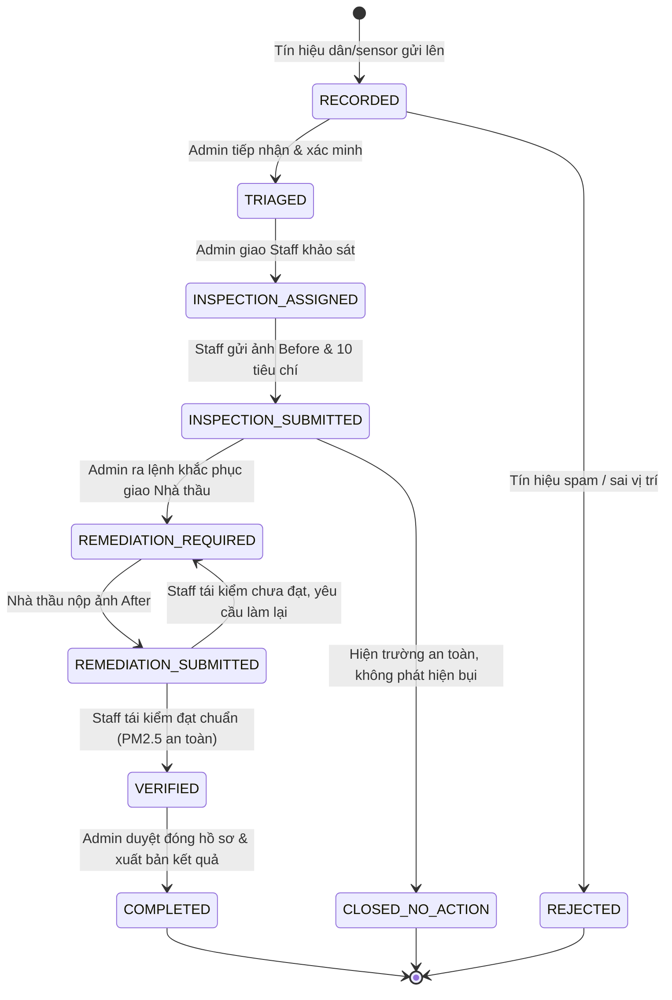

# CASE STATE MACHINE — DUSTGUARD VN V2
## Máy Trạng Thái Đơn Nhất Vòng Đời Vụ Việc (Single Lifecycle SSOT)

> **Nguyên tắc**: Tối giản tối đa các trạng thái trung gian, chỉ giữ các trạng thái phản ánh bước hành động thực tế có người phụ trách.

---

## 1. SƠ ĐỒ CHUYỂN TRẠNG THÁI (STATE TRANSITION DIAGRAM)

---

## 2. BẢNG MAPPING TRẠNG THÁI V2 (7 CANONICAL STATES)

| Mã Trạng Thái (Database Enum) | Tiếng Việt UI (Canonical) | Người Phụ Trách | Ý Nghĩa Thực Tế | Việc Cần Làm Tiếp Theo |
|---|---|---|---|---|
| `RECORDED` | **Mới ghi nhận** | Hệ thống | Tín hiệu vừa được gửi vào hệ thống | Admin kiểm tra thông tin ban đầu |
| `TRIAGED` | **Đã tiếp nhận** | Admin | Đã xác minh vị trí và lý do cần ưu tiên | Giao cán bộ khảo sát hiện trường |
| `INSPECTION_ASSIGNED` | **Đang khảo sát** | Staff | Cán bộ đang trên đường tới kiểm tra | Staff chụp ảnh Before & chấm checklist |
| `REMEDIATION_REQUIRED` | **Yêu cầu khắc phục** | Contractor | Đã giao lệnh xử lý cho nhà thầu (SLA 24h) | Nhà thầu phun nước, quây bạt & nộp ảnh After |
| `REMEDIATION_SUBMITTED` | **Chờ tái kiểm** | Staff / TNV | Nhà thầu đã báo hoàn thành | Cán bộ quay lại tái kiểm thực tế |
| `VERIFIED` | **Tái kiểm đạt chuẩn** | Admin | Hiện trường đã sạch, PM2.5 an toàn | Admin duyệt hoàn tất vụ việc |
| `COMPLETED` | **Đã hoàn tất** | — | Vụ việc đã giải quyết xong, lưu hồ sơ | Không còn việc tồn đọng |
| `REJECTED` | **Từ chối / Đóng sớm** | — | Tín hiệu không chính xác hoặc trùng lặp | Lưu vết lý do từ chối |

---

## 3. QUY TẮC BẤT BIẾN KHI CHUYỂN TRẠNG THÁI (TRANSITION INVARIANTS)

1. **Cấm chuyển cóc (No Shortcut)**: Không thể chuyển thẳng từ `RECORDED` sang `COMPLETED` mà không có bước kiểm tra hoặc nộp minh chứng.
2. **Bắt buộc có Bằng chứng (Evidence Required)**:
   - Chuyển sang `INSPECTION_SUBMITTED` bắt buộc có ít nhất 1 ảnh Before và đánh giá 10 tiêu chí QCVN 18.
   - Chuyển sang `REMEDIATION_SUBMITTED` bắt buộc có ảnh After chụp trong bán kính Geofence $<50$m.
   - Chuyển sang `COMPLETED` bắt buộc có kết quả tái kiểm đạt chuẩn.
3. **Lưu vết Bất biến (Immutable Audit)**: Mọi lần đổi trạng thái đều tự động sinh 1 bản ghi trong bảng `audit_logs` gồm: `case_id`, `actor_id`, `from_status`, `to_status`, `reason`, `created_at`.
