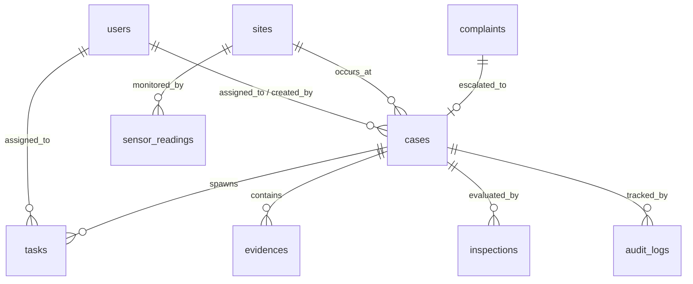

# DB DOMAIN MAP V2 — DUSTGUARD VN
## Kiến Trúc Dữ Liệu Tối Giản Khớp Đúng Domain Model Thực Tế

> **Nguyên tắc**: Không tạo bảng hoặc cột trong CSDL chỉ vì một màn hình cần hiển thị một widget. CSDL D1 SQLite là chân thực duy nhất (SSOT) phản ánh đúng các thực thể nghiệp vụ cốt lõi.

---

## 1. CHÍN THỰC THỂ CỐT LÕI (9 CORE DOMAIN ENTITIES)

```text
┌─────────────────────────────────────────────────────────────────────────────────┐
│                                D1 DOMAIN MODEL V2                               │
├─────────────────────┬───────────────────────────────────────────────────────────┤
│ 1. users            │ Tài khoản, thông tin định danh & vai trò (5 roles RBAC)  │
│ 2. complaints       │ Tín hiệu phản ánh ban đầu từ cộng đồng (Ảnh, GPS, Danh mục)│
│ 3. cases            │ Vụ việc theo dõi xuyên suốt 7 bước tác nghiệp             │
│ 4. tasks            │ Nhiệm vụ cụ thể giao cho Cán bộ hoặc Nhà thầu thi công    │
│ 5. sites            │ Công trình thi công xây dựng trên địa bàn                 │
│ 6. evidences        │ Kho minh chứng hình ảnh số (Object key R2 & Hash SHA-256) │
│ 7. inspections      │ Biên bản kiểm tra thực địa & Checklist 10 tiêu chí QCVN 18│
│ 8. sensor_readings  │ Dữ liệu đo đạc nồng độ bụi thời gian thực từ trạm IoT     │
│ 9. audit_logs       │ Sổ nhật ký lưu vết bất biến (Append-Only Audit Trail)     │
└─────────────────────┴───────────────────────────────────────────────────────────┘
```

---

## 2. QUAN HỆ GIỮA CÁC THỰC THỂ (RELATIONSHIP MAPPING)



---

## 3. CẤU TRÚC BẢNG D1 SQLITE CHUẨN HÓA

### 3.1 Bảng `cases` (Vụ việc tác nghiệp trung tâm)
- `id` (TEXT PRIMARY KEY, VD: `case_0842`)
- `code` (TEXT UNIQUE, VD: `DG-2026-0842`)
- `title` (TEXT NOT NULL)
- `site_id` (TEXT REFERENCES sites(id))
- `status` (TEXT NOT NULL CHECK: `RECORDED, TRIAGED, INSPECTION_ASSIGNED, REMEDIATION_REQUIRED, REMEDIATION_SUBMITTED, VERIFIED, COMPLETED, REJECTED`)
- `priority` (TEXT CHECK: `LOW, MEDIUM, HIGH, URGENT`)
- `assigned_to` (TEXT REFERENCES users(id))
- `contractor_id` (TEXT REFERENCES users(id))
- `sla_deadline` (DATETIME)
- `created_at` (DATETIME DEFAULT CURRENT_TIMESTAMP)
- `completed_at` (DATETIME)

### 3.2 Bảng `inspections` (Biên bản kiểm tra & Checklist QCVN)
- `id` (TEXT PRIMARY KEY)
- `case_id` (TEXT REFERENCES cases(id))
- `inspector_id` (TEXT REFERENCES users(id))
- `checklist_results` (TEXT JSON: Lưu trạng thái 10 tiêu chí QCVN 18)
- `pm25_measured` (REAL)
- `conclusion` (TEXT CHECK: `PASS, FAIL, IMPROVEMENT_REQUIRED`)
- `created_at` (DATETIME DEFAULT CURRENT_TIMESTAMP)

### 3.3 Bảng `evidences` (Kho lưu trữ minh chứng số)
- `id` (TEXT PRIMARY KEY)
- `case_id` (TEXT REFERENCES cases(id))
- `type` (TEXT CHECK: `BEFORE, AFTER, REINSPECTION`)
- `r2_key` (TEXT NOT NULL)
- `sha256_hash` (TEXT NOT NULL)
- `lat` (REAL), `lng` (REAL)
- `geofence_valid` (BOOLEAN DEFAULT 0)
- `created_at` (DATETIME DEFAULT CURRENT_TIMESTAMP)

### 3.4 Bảng `audit_logs` (Nhật ký lưu vết bất biến)
- `id` (TEXT PRIMARY KEY)
- `case_id` (TEXT REFERENCES cases(id))
- `actor_id` (TEXT REFERENCES users(id))
- `action` (TEXT NOT NULL)
- `from_status` (TEXT), `to_status` (TEXT)
- `notes` (TEXT)
- `created_at` (DATETIME DEFAULT CURRENT_TIMESTAMP)
